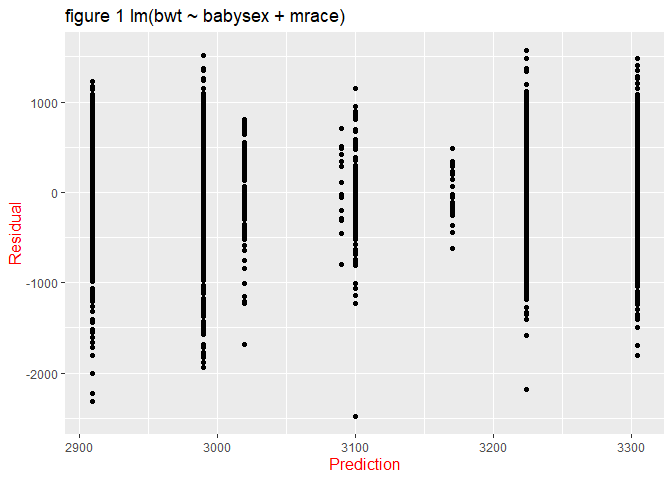
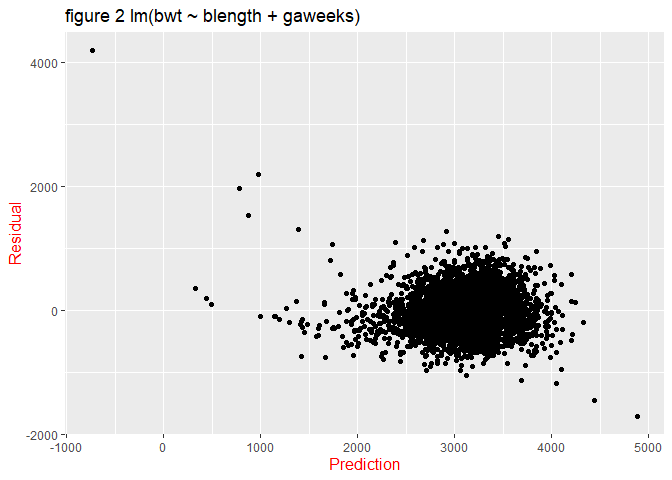
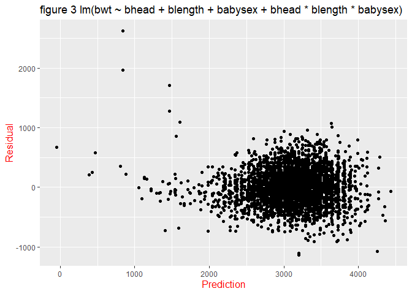

yh2736
================
Yongmei Huang
11/16/2019

# Problem 1

``` r
###Upload the data
birth_weight_dataset <- read_csv(file = "./data/birthweight.csv", 
                                 col_types = cols(
                                   babysex = col_factor(),
                                   frace = col_factor(),
                                   malform = col_factor(),
                                   mrace = col_factor()
                                 )) %>% 
  janitor::clean_names()

###Check missing data and display in table
birth_weight_dataset %>% 
  map_df(~sum(is.na(.x))) %>%
  unnest() %>% 
  pivot_longer(
    babysex:wtgain,
    names_to = "variable",
    values_to = "num_missing_value"
  ) %>% 
  knitr::kable(
    caption = "Table 1 The number of missing data in birthweight data frame"
  ) 
```

| variable | num\_missing\_value |
| :------- | ------------------: |
| babysex  |                   0 |
| bhead    |                   0 |
| blength  |                   0 |
| bwt      |                   0 |
| delwt    |                   0 |
| fincome  |                   0 |
| frace    |                   0 |
| gaweeks  |                   0 |
| malform  |                   0 |
| menarche |                   0 |
| mheight  |                   0 |
| momage   |                   0 |
| mrace    |                   0 |
| parity   |                   0 |
| pnumlbw  |                   0 |
| pnumsga  |                   0 |
| ppbmi    |                   0 |
| ppwt     |                   0 |
| smoken   |                   0 |
| wtgain   |                   0 |

Table 1 The number of missing data in birthweight data frame

``` r
###Summary the dataset
###Define the function "my_summary"
my_summary <- function(x, na.rm=TRUE){
  c(Mean=mean(x, na.rm=na.rm, digits = 0),
    SD=sd(x, na.rm=na.rm),
    Median=median(x, na.rm=na.rm),
    Min=min(x, na.rm=na.rm),
    Max=max(x, na.rm=na.rm), 
    N=length(x))}

###Identity the numeric column
ind <- sapply(birth_weight_dataset, is.numeric)

###Apply "my_summary" to numeric columns only
sapply(birth_weight_dataset[, ind], my_summary) %>%
  t() %>% 
  knitr::kable(
    digits = 2,
    caption = "Table 2 The summary of birth weight dataset"
  ) 
```

|          |    Mean |     SD |  Median |     Min |    Max |    N |
| -------- | ------: | -----: | ------: | ------: | -----: | ---: |
| bhead    |   33.65 |   1.62 |   34.00 |   21.00 |   41.0 | 4342 |
| blength  |   49.75 |   2.72 |   50.00 |   20.00 |   63.0 | 4342 |
| bwt      | 3114.40 | 512.15 | 3132.50 |  595.00 | 4791.0 | 4342 |
| delwt    |  145.57 |  22.21 |  143.00 |   86.00 |  334.0 | 4342 |
| fincome  |   44.11 |  25.98 |   35.00 |    0.00 |   96.0 | 4342 |
| gaweeks  |   39.43 |   3.15 |   39.90 |   17.70 |   51.3 | 4342 |
| menarche |   12.51 |   1.48 |   12.00 |    0.00 |   19.0 | 4342 |
| mheight  |   63.49 |   2.66 |   63.00 |   48.00 |   77.0 | 4342 |
| momage   |   20.30 |   3.88 |   20.00 |   12.00 |   44.0 | 4342 |
| parity   |    0.00 |   0.10 |    0.00 |    0.00 |    6.0 | 4342 |
| pnumlbw  |    0.00 |   0.00 |    0.00 |    0.00 |    0.0 | 4342 |
| pnumsga  |    0.00 |   0.00 |    0.00 |    0.00 |    0.0 | 4342 |
| ppbmi    |   21.57 |   3.18 |   21.03 |   13.07 |   46.1 | 4342 |
| ppwt     |  123.49 |  20.16 |  120.00 |   70.00 |  287.0 | 4342 |
| smoken   |    4.15 |   7.41 |    0.00 |    0.00 |   60.0 | 4342 |
| wtgain   |   22.08 |  10.94 |   22.00 | \-46.00 |   89.0 | 4342 |

Table 2 The summary of birth weight dataset

``` r
###Using baby's sex and mother's race as predictors
fit1 <-  lm(bwt ~ babysex + mrace, data = birth_weight_dataset) 

###draw the figure1 with lm(bwt ~ babysex + mrace)
birth_weight_dataset %>% 
  modelr::add_residuals(fit1) %>% 
  modelr::add_predictions(fit1) %>% 
  ggplot(aes(x = pred, y = resid)) +
  geom_point() + 
  xlab("Prediction") +
  ylab("Residual") +
  theme(
    axis.title.x = element_text(size = 12, 
                                color = "red"),
    axis.title.y = element_text(size = 12, 
                                color = "red")
  ) +
  labs(
    title = "figure 1 lm(bwt ~ babysex + mrace) "
  )
```

<!-- -->

``` r
###Using length at birth and gestational age as predictors
fit2 <- lm(bwt ~ blength + gaweeks, data = birth_weight_dataset)

###Draw a plot 
birth_weight_dataset %>% 
  modelr::add_residuals(fit2) %>% 
  modelr::add_predictions(fit2) %>% 
  ggplot(aes(x = pred, y = resid)) +
  geom_point() + 
  xlab("Prediction") +
  ylab("Residual") +
  theme(
    axis.title.x = element_text(size = 12, 
                                color = "red"),
    axis.title.y = element_text(size = 12, 
                                color = "red")
  ) +
  labs(
    title = "figure 2 lm(bwt ~ blength + gaweeks) "
  )
```

<!-- -->

``` r
###using head circumference, length, sex, and all interactions (including the three-way interaction)
fit3 <- lm(bwt ~ bhead + blength + babysex + bhead * blength * babysex, 
           data = birth_weight_dataset)

###Draw a plot 
birth_weight_dataset %>% 
  modelr::add_residuals(fit3) %>% 
  modelr::add_predictions(fit3) %>% 
  ggplot(aes(x = pred, y = resid)) +
  geom_point() + 
  xlab("Prediction") +
  ylab("Residual") +
  theme(
    axis.title.x = element_text(size = 12, 
                                color = "red"),
    axis.title.y = element_text(size = 12, 
                                color = "red")
  ) +
  labs(
    title = "figure 3 lm(bwt ~ bhead + blength + babysex + bhead * blength * babysex) "
  )
```

<!-- -->

``` r
###Get the rmse value
cv_birth_weight <- crossv_mc(birth_weight_dataset, 100) %>% 
  mutate(
    train = map(train, as_tibble),
    test = map(test, as_tibble)
  ) %>% 
  mutate(
    linear_mode1 = map(train, ~lm(bwt ~ babysex + mrace, data = .x)),
    linear_mode2 = map(train, ~lm(bwt ~ blength + gaweeks, data = .x)),
    linear_mode3 = map(train, ~lm(bwt ~ bhead + blength + babysex + bhead * blength * babysex,  
                                  data = .x))
  ) %>% 
  mutate(
    rmse_linear_mode1 = map2_dbl(linear_mode1, test, ~rmse(model = .x, data = .y)),
    rmse_linear_mode2 = map2_dbl(linear_mode2, test, ~rmse(model = .x, data = .y)),
    rmse_linear_mode3 = map2_dbl(linear_mode3, test, ~rmse(model = .x, data = .y))
  )


###Draw a plot to shows the distribution of RMSE values for each candidate model.
cv_birth_weight %>% 
  select(starts_with("rmse")) %>% 
  pivot_longer(
    everything(),
    names_to = "model",
    values_to = "rmse",
    names_prefix = "rmse_"
  ) %>% 
  ggplot(aes(x = model, y = rmse)) +
  geom_violin() +
  xlab("Linear Models") +
  ylab("RMSE") +
  theme(
    axis.title.x = element_text(size = 12, 
                                color = "red"),
    axis.title.y = element_text(size = 12, 
                                color = "red")
  ) +
  labs(
    title = "figure 4 RMSE of three differen linear models "
  )
```

<!-- -->

*Figure4 indicates that the model including head circumference, length,
sex, and all interactions performs best with a lowest RMSE. On the other
hand, the model I proposed using baby’s sex and mother’s race has lowest
capacity of prediction of baby’s birth weight.*

# problem 2

``` r
###download the data
weather_df = 
  rnoaa::meteo_pull_monitors(
    c("USW00094728"),
    var = c("PRCP", "TMIN", "TMAX"), 
    date_min = "2017-01-01",
    date_max = "2017-12-31") %>%
  mutate(
    name = recode(id, USW00094728 = "CentralPark_NY"),
    tmin = tmin / 10,
    tmax = tmax / 10) %>%
  select(name, id, everything())
```

``` r
### Select variable "tmax" and "tmin" from the dataset
weather_df <-  weather_df %>% 
  select(tmax, tmin)

### Draw bootstrap samples for 5000 times
bootstrap_weather_df <- weather_df %>% 
  modelr::bootstrap(n = 5000) %>% 
  mutate(
    result_list = map(strap, ~lm(tmax ~ tmin, data = .x)),
    tidy_list = map(result_list, broom::tidy),
    glance_list = map(result_list, broom::glance)
  )
```

``` r
###Pull beta0
beta0_df <- bootstrap_weather_df %>% 
  pull(tidy_list) %>% 
  bind_rows() %>% 
  select(term, estimate) %>% 
  as_tibble() %>% 
  filter(row_number() %% 2 != 0) %>% 
  mutate(
    id = c(1:5000),
    beta0 = estimate
  ) %>% 
  select(id, beta0)

###Pull beta1
beta1_df <- bootstrap_weather_df %>% 
  pull(tidy_list) %>% 
  bind_rows() %>% 
  select(term, estimate) %>% 
  as_tibble() %>% 
  filter(row_number() %% 2 == 0) %>% 
  mutate(
    id = c(1:5000),
    beta1 = estimate
  ) %>% 
  select(id, beta1)

###combine beta0 and beta1 dataframe
estimate_df <- left_join(beta0_df, beta1_df, by = "id")
```

``` r
###Plot the distribution of estimates
estimate_df %>% 
  ggplot(aes(x = beta0, y = beta1)) +
  geom_point(alpha = 0.5) +
  xlab("Beta0") +
  ylab("Beta1") +
  theme(
    axis.title.x = element_text(size = 12, 
                                color = "red"),
    axis.title.y = element_text(size = 12, 
                                color = "red")
  ) +
  labs(
    title = "figure 5 Estimates distribution "
  )
```

<!-- -->

*From Figure 5, the range of beta0 is from 6.25 to 8.25, and the range
of beta1 is (0.975, 1.100)*

``` r
###pull the r.squared value from glance_list
r_squared_df <- bootstrap_weather_df %>% 
  pull(glance_list) %>%
  bind_rows() %>% 
  janitor::clean_names() %>% 
  mutate(
    id = rep(1:5000)
  ) %>% 
  select(id, r_squared)


estimate_df <- estimate_df %>% 
  mutate(
    log_beta0_mult_beta1 = log10(beta0 * beta1)
  ) %>% 
  left_join(., r_squared_df, by = "id")

sd_log_beta0_mult_beta1 <- sd(estimate_df$log_beta0_mult_beta1, na.rm = TRUE)

sd_r_squared <-  sd(estimate_df$r_squared, na.rm = TRUE)

mean_log_beta0_mult_beta1 <- mean(estimate_df$log_beta0_mult_beta1, na.rm = TRUE)

mean_r_squared <- mean(estimate_df$r_squared, na.rm = TRUE)
```

*THe 95% confidence interval for r^2 is from 0.9114704 to 0.9110668.*

*THe 95% confidence interval for log(β<sup>0∗β</sup>1) is from 0.874595
to 0.8741171.*
